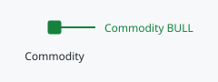
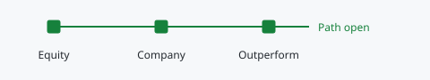

# Market gates

Markets follows commodity-linked evidence through Commodity, Equity, Company and Outperform. These are recorded trend states, not four automatic instructions to purchase.

## Direct commodity sleeve

Commodity is the direct commodity CDF for that market. It governs an approved direct-commodity vehicle and does not open, close or resize producer-equity exposure. If no accessible vehicle exists, positive commodity evidence alone cannot create one to buy.

## Equity, Company, then Outperform

Equity is the producer basket relative to its commodity. Company summarises the existing CDF state of eligible companies in that market. Outperform summarises each eligible company relative to the producer basket. Research, entry, sizing, cash and TMS remain separate controls.

## Reading The Market Map

Each row has two column groups, because the direct commodity and producer
equities are separate sleeves.

**Direct commodity**

- **Trend:** the direct commodity CDF, shown as Bull or Bear.
- **60D:** the direct commodity source's 60-day return, with its own source date on hover.
- **Vehicle:** the approved broker vehicle, if one is recorded. A dash means the
  market is signal only, so the trend is context. **Review vehicle** means the
  direct sleeve has a target but no approved vehicle.

**Producer equities**

- **Equity regime:** the producer basket relative to its commodity (for example
  `GDX / GLD`). **Open** is a Buy state: new producer-equity entries follow the
  normal CDF/TMS rules. **Closed** is a Sell state: new entries, adds, breakouts
  and re-entries are blocked.
- **Qualifying:** the companies that are both in a CDF uptrend and outperforming
  the producer basket, counted per company, for example `2 of 4`. The marks show
  every eligible company: solid for Qualifies, hollow for Lags basket (uptrend
  but underperforming), a dash for Downtrend and a dashed outline for Incomplete
  evidence. They are dimmed while the regime is closed, because they cannot
  unlock new deployment.
- **Held / budget:** invested producer-equity value against the approved sleeve
  budget. Class cash held appears on hover.

The header counts how many equity regimes are open. No row combines these
signals into a verdict or target.

## Signal States

- **Bull / Open:** the recorded closed-bar CDF state is Buy.
- **Bear / Closed:** the recorded closed-bar CDF state is Sell.
- **Off or dash:** no connected feed or usable current state is available. It is
  not a neutral or bearish observation.

## Market Detail

Clicking a market row opens its detail view, using the same two sleeves.

- **Direct commodity:** the commodity trend with its 60-day return and the
  date of the latest signal. A vehicle line appears only when a broker vehicle
  is approved or needs review; signal only is the default and is not restated.
- **Producer equities:** the equity regime (Open or Closed, with what that
  permits) and the qualifying companies with their standing mix. Each signal
  shows the date of its latest event, because an old signal is not the same
  as a current one.
- **Sleeve:** held producer equities with their share of the approved budget,
  the approved budget and class cash held. Class cash stays within the class.
- **Company evidence:** each company's Trend, its direction against the
  producer basket and its standing. Select a company to show it in both the
  Company trend and Outperform charts; the chart titles name the company.
  Producer ETFs in the class are listed below the companies under **Funds**
  with their own trend. Selecting a fund charts it in the trend chart;
  Outperform applies to companies only, and funds never count towards
  Qualifying.

## Configure And Investigate

A plug icon appears beside the expand control only when a connection is missing; it opens [Alerts](alerts.md), where you record the feed and its current direction. The expand control lists each company with its Trend, its direction against the producer basket and its resulting standing, aligned under the Producer equities columns. Clicking the market row opens its detailed view.

Edit the market at the left edge to update its name and source pair when an exchange symbol changes. Source changes also affect the corresponding Alerts setup; confirm the new source rather than assuming the old connection still applies. The 60-day percentage sits in the Direct commodity group. It is price-history evidence with its own source date, separate from the trend signal and from the producer-equity regime.
